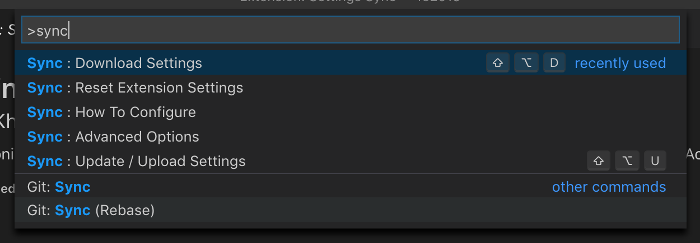
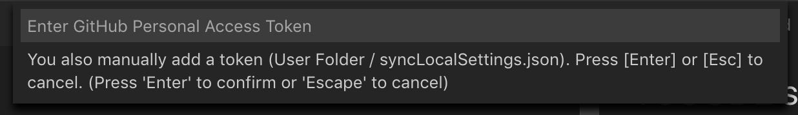
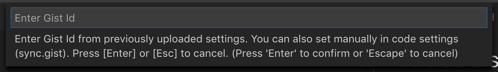
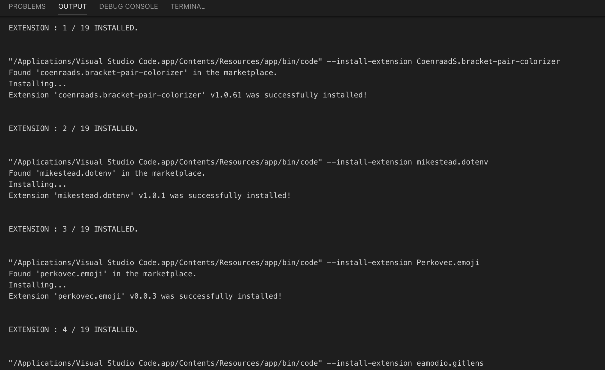
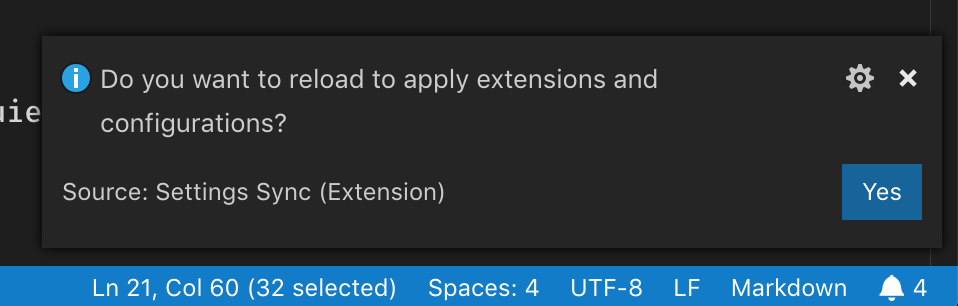

# VSCODE setting

## Download & Install

- [VSCODE](https://code.visualstudio.com/)
- [Settings Sync Plugin](https://marketplace.visualstudio.com/items?itemName=Shan.code-settings-sync) : vscode 세팅들 동기화 해주는 플러그인입니다.

## 세팅 동기화 하기

- Personal Access Token: [access token 생성하기](https://github.com/settings/tokens)
- Gist ID: `6ab2c014130c6910954320115fc85add` (public 세팅 파일입니다.)

### Personal Access Token 생성하기

- vscode 실행후
  - 맥: `cmd` + `p`
  - 윈도우: `window` + `p` (맞을거에요...)

- `>sync: Download Settings` 입력하면 깃헙으로 토큰생성 페이지로 브라우져가 열립니다.

- 브라우저가 열리지 않으면 => [Generate New Token](https://github.com/settings/tokens)
이동후 아래와같이 토큰을 만들어주세요

- 토큰이 생성되면 해쉬코드를 안전한곳에 저장해두세요 (다시 보이지 않아요. 전 email로 보내둡니다 ㅎ)

### 세팅 동기화하기

- `>sync: Download Settings` 입력을 하면 vscode 에선 차례대로 `access token`과 `gist id`를 요구합니다.

- `access token`은 깃헙에서 생성해서 복사한 코드입니다

- `gist id`는 깃헙 기스트에 올라가있는 세팅파일입니다. 제가 공개용으로 만들어둔 세팅을 사용합니다.
- public gist id: `6ab2c014130c6910954320115fc85add`

- 그러면 콘솔에서 설치를 시작합니다.

- 설치가 끝나면 에디터를`reload`해줍니다

## 마치며

- 플러그인이나 단축키들은 제 개인용으로 쓰는 세팅이라 조금 이상할수도 있습니다.
- 사용된 플러그인에 대한 설명은 사용하면서 하나씩 설명드릴게요
- 나중엔 개인용 세팅도 처음부터 해보시는걸 추천합니다.
- [settings sync docs](https://marketplace.visualstudio.com/items?itemName=Shan.code-settings-sync)